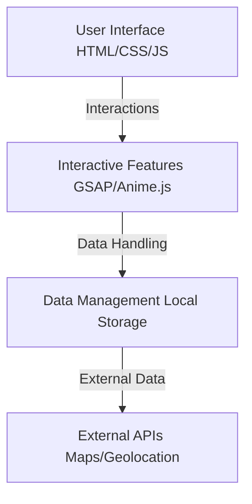

# 🌱 PURE
### Planet Unity for Resource Environment

**EcoSphere** adalah platform digital inovatif yang menghubungkan masyarakat dengan aksi nyata pelestarian lingkungan.  
*Mengedukasi, Menginspirasi, dan Memfasilitasi partisipasi aktif untuk bumi yang lebih baik.*

[Demo Website](https://github.com/Rio3zN9G/Technoversary-TIM-CASPER-A) • [Report Bug](https://github.com/Rio3zN9G/Technoversary-TIM-CASPER-A/issues) • [Request Feature](https://github.com/Rio3zN9G/Technoversary-TIM-CASPER-A/issues)

---

## 🏆 Tim Pengembang

**Tim CASPER A** - SMK Pertiwi Kuningan

| Nama | Kelas | Peran |
| :--- | :---: | :--- |
| **Ario Zulkaisi Nubli** | XII RPL 2 | Leader |
| **Syaidina** | XII RPL 1 | Member |
| **M.Thosim** | XII RPL 2 | Member |

---

## 🛠️ Technology Stack

### Frontend Core
  

### Libraries & Frameworks
  
- **AOS (Animate On Scroll)**
- **Particles.js**
- **Anime.js**
- **Dragula**
- **Notyf**
- **Google Fonts** (Poppins & Montserrat)

---

## ✨ Fitur Utama

### 1. 🌍 Hero Section Interaktif
Pengalaman visual yang memukau sejak detik pertama.
- **Animasi Partikel**: Background dinamis yang hidup.
- **Typing Effect**: Pesan penyambut yang personal.
- **3D Earth**: Visualisasi bumi interaktif (SVG/Canvas).

### 2. 📚 Edukasi Lingkungan (Gamified)
Belajar menjadi menyenangkan.
- **Drag & Drop Learning**: Metode belajar interaktif.
- **Sistem Poin**: Reward untuk setiap modul yang diselesaikan.
- **Badges**: Pencapaian visual untuk motivasi.

### 3. 🗺️ Aksi Lingkungan & Peta
Pantau dan beraksi di sekitarmu.
- **Geolocation**: Deteksi lokasi real-time.
- **Carbon Calculator**: Hitung jejak karbon harianmu.
- **Event Map**: Temukan event lingkungan terdekat.

### 4. 👥 Komunitas & Sosial
Terhubung dengan sesama Eco-Warriors.
- **Forum Diskusi**: Ruang berbagi ide.
- **Interactive Chat**: Komunikasi seamless.
- **Engagement**: Like, Comment, dan Share.

### 5. ♻️ Bank Sampah Digital
Manajemen sampah cerdas.
- **Tracking**: Pantau riwayat penyetoran sampah.
- **Redemption**: Tukar poin sampah dengan reward.
- **History**: Log aktivitas lengkap.

---

## 🚀 Arsitektur & Alur Kerja

### Implementasi Kunci
- **Responsive Design**: Mobile-first, Grid & Flexbox, Breakpoints optimization.
- **Performance**: Lazy loading, GSAP optimization, Minimal DOM manipulation.
- **UX**: Smooth scrolling, Micro-interactions, Error handling.
- **SEO**: Semantic HTML, Meta tags, Open Graph, Structured data.

---

## 📱 Kompatibilitas Device

| Device | Resolusi | Layout |
| :--- | :--- | :--- |
| **Desktop** | > 1200px | Full Feature Layout |
| **Tablet** | 768px - 1199px | Adaptive + Mobile Nav |
| **Mobile** | < 768px | Mobile-First + Bottom Nav |

---

## 📸 Galeri Aplikasi

<strong>Klik untuk melihat Screenshot</strong>

### Profile & Dashboard

### Education Module

### Action Map

### Carbon Calculator

### Leaderboard

### Community Forum

### Waste Bank

---

## 🤝 Kolaborasi

Kami terbuka untuk kolaborasi dengan:
- 🏫 Institusi Pendidikan
- 🏢 Lembaga Pemerintah
- 🌱 Komunitas Lingkungan
- 🌏 NGO Internasional

> *"PURE - Mulai dari Diri, Selamatkan Bumi"*

---

Made by **Tim CASPER A**

