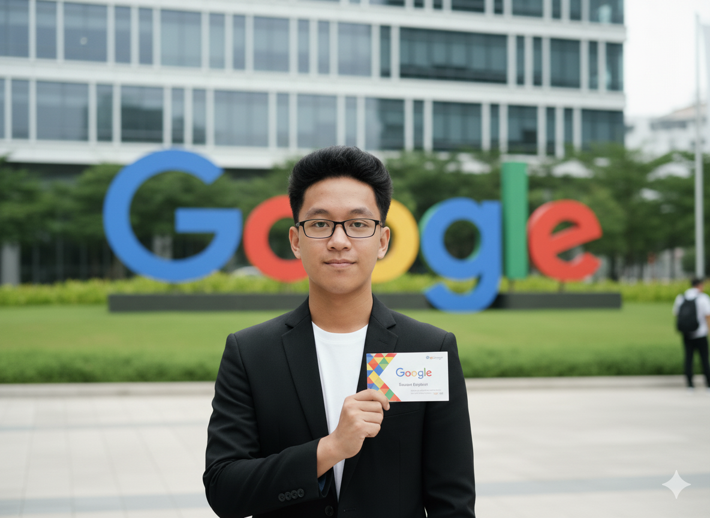

<div align="center">


# 🌱 PURE (Planet Unity for Resource Environment)
### *Platform Edukasi & Aksi Lingkungan Terintegrasi Berbasis Gamifikasi*

[](https://planetunityforresourcesenviroment.vercel.app)
[](LICENSE)
[](https://github.com/Rio3zN9G/Technoversary-TIM-CASPER-A)

<p align="center">
  <b>Mengedukasi</b> • <b>Menginspirasi</b> • <b>Memfasilitasi</b>
</p>

</div>

---

## 🌟 Tentang PURE

**PURE (Planet Unity for Resource Environment)** adalah sebuah ekosistem digital komprehensif yang dirancang untuk menjembatani kesenjangan antara kesadaran lingkungan dan aksi nyata. Kami menggabungkan teknologi web modern, gamifikasi, dan interaksi sosial untuk menciptakan pengalaman pengguna yang imersif dan berdampak.

Di era krisis iklim ini, PURE hadir bukan hanya sebagai website informasi, tetapi sebagai **katalis perubahan perilaku**. Melalui fitur-fitur seperti Bank Sampah Digital, Kalkulator Jejak Karbon, dan Peta Aksi Komunitas, kami memberdayakan setiap individu untuk menjadi pahlawan lingkungan.

---

## 🏆 Tim Pengembang (CASPER A)

Proyek ini dikembangkan dengan penuh dedikasi oleh siswa-siswa berbakat dari **SMK Pertiwi Kuningan** untuk kompetisi **Technoversary**.

| Foto | Nama | Peran & Kelas | Kontak |
| :---: | :--- | :--- | :---: |
|  | **Ario Zulkaisi Nubli**<br>*(XII RPL 2)* | **Lead Developer**<br>• XII RPL 2 | [](https://www.instagram.com/itsriod) |
|  | **Syaidina**<br>*(XII RPL 1)* | **Member**<br>• XII RPL 1 | [](https://www.instagram.com/gudeldeveloper) |
|  | **M. Thosim**<br>*(XII RPL 2)* | **Member**<br>•XII RPL 2 | [](https://www.instagram.com/thoosiin) |

---

## 🚀 Fitur Unggulan (Key Features)

PURE menghadirkan serangkaian fitur canggih yang terintegrasi dalam satu platform seamless:

### 1. 🎨 **Immersive User Experience**
- **Hero Section Sinematik**: Latar belakang video dengan overlay interaktif dan animasi 3D floating icons.
- **Glassmorphism Design**: Antarmuka modern dengan efek kaca premium, memberikan kesan futuristik dan bersih.
- **Micro-Interactions**: Animasi halus (reveal, stagger, hover effects) yang merespons setiap tindakan pengguna.

### 2. ♻️ **Bank Sampah Digital (Smart Waste Bank)**
- **Real-time Tracking**: Pantau jumlah sampah yang disetor dan dampaknya terhadap lingkungan.
- **Dynamic Filtering**: Filter jenis sampah (Plastik, Kertas, Logam, dll) dengan animasi transisi yang mulus.
- **Points System**: Konversi sampah menjadi poin yang dapat ditukarkan (gamifikasi ekonomi sirkular).

### 3. 🌍 **Peta Aksi & Geolocation**
- **Interactive Map**: Integrasi Leaflet.js untuk menampilkan event lingkungan dan lokasi bank sampah terdekat.
- **User Tracking**: Deteksi lokasi pengguna secara real-time untuk rekomendasi aksi lokal.
- **Event Popups**: Detail event dengan tombol "Join" instan.

### 4. 📊 **Kalkulator Jejak Karbon**
- **Personalized Assessment**: Hitung emisi karbon harian berdasarkan transportasi, energi, dan konsumsi.
- **Visual Data**: Grafik progres bar animasi untuk memvisualisasikan dampak pengguna.
- **Actionable Insights**: Rekomendasi spesifik berdasarkan hasil perhitungan (Rendah/Sedang/Tinggi).

### 5. 💬 **Komunitas & Smart Chatbot**
- **AI-Powered Chatbot**: Asisten virtual yang menjawab pertanyaan seputar lingkungan secara instan.
- **Discussion Forum**: Ruang diskusi real-time antar pengguna dengan antarmuka chat modern.
- **Leaderboard**: Peringkat pengguna teratas (PURE-Warriors) untuk memacu kompetisi sehat.

---

## 🛠️ Teknologi (Tech Stack)

Kami menggunakan teknologi web terkini untuk memastikan performa, aksesibilitas, dan keindahan visual.

### **Frontend Core**


### **Libraries & Frameworks**
| Kategori | Teknologi | Kegunaan |
| :--- | :--- | :--- |
| **Animation** |  | Animasi kompleks, scroll triggers, dan timeline. |
| **Animation** |  | Animasi partikel dan efek mikro. |
| **Maps** |  | Peta interaktif dan visualisasi geospasial. |
| **UI Components** |  | Ikon vektor skalabel dan modern. |
| **Notifications** |  | Notifikasi toast yang elegan dan non-intrusif. |
| **Particles** |  | Efek latar belakang interaktif. |

---

## 📸 Galeri Tampilan (Screenshots)

<div align="center">
  <table>
    <tr>
      <td align="center"><b>Hero Section</b><br>Tampilan awal yang memukau dengan video bg</td>
      <td align="center"><b>Education Cards</b><br>Modul belajar interaktif dengan glassmorphism</td>
    </tr>
    <tr>
      <td></td>
      <td></td>
    </tr>
    <tr>
      <td align="center"><b>Action Map</b><br>Peta interaktif untuk lokasi event</td>
      <td align="center"><b>Waste Bank</b><br>Manajemen sampah digital</td>
    </tr>
    <tr>
      <td></td>
      <td></td>
    </tr>
  </table>
</div>

---

## ⚙️ Instalasi & Penggunaan

Ikuti langkah-langkah berikut untuk menjalankan proyek ini di mesin lokal Anda:

1.  **Clone Repository**
    ```bash
    git clone https://github.com/Rio3zN9G/Technoversary-TIM-CASPER-A.git
    ```

2.  **Masuk ke Direktori**
    ```bash
    cd Technoversary-TIM-CASPER-A
    ```

3.  **Jalankan Project**
    Cukup buka file `index.html` di browser modern pilihan Anda (Chrome, Firefox, Edge, Safari).
    > Disarankan menggunakan ekstensi **Live Server** di VS Code untuk pengalaman pengembangan terbaik.

---

## 🤝 Kontribusi & Kolaborasi

Kami sangat terbuka untuk kolaborasi! Jika Anda ingin berkontribusi:

1.  Fork repository ini.
2.  Buat branch fitur baru (`git checkout -b fitur-keren`).
3.  Commit perubahan Anda (`git commit -m 'Menambahkan fitur keren'`).
4.  Push ke branch (`git push origin fitur-keren`).
5.  Buat Pull Request.

---

<div align="center">

### *"Satu langkah kecil untuk kita, satu lompatan besar untuk bumi."*

Copyright © 2025 **Tim CASPER A - SMK Pertiwi Kuningan**. All Rights Reserved.

[](https://www.instagram.com/smkpertiwikng)
[](https://smkpertiwikng.sch.id/)

</div>


